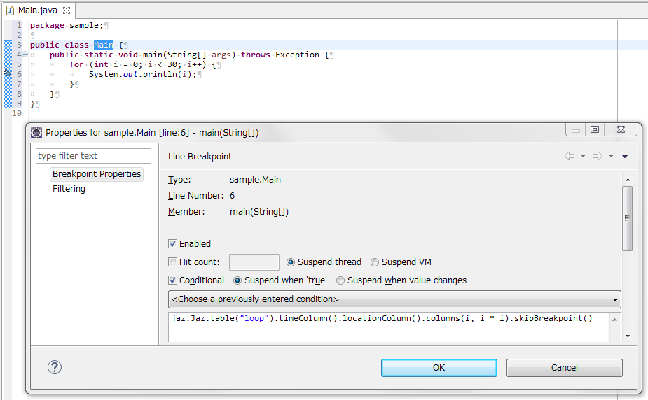
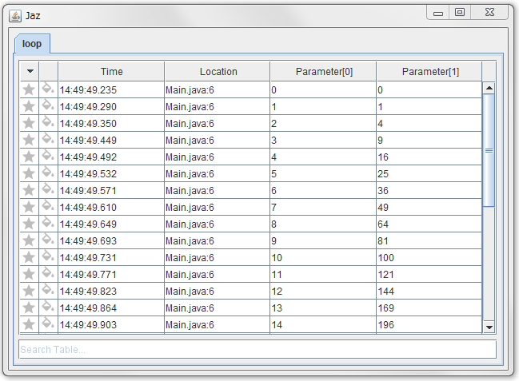

# JazCode

Print debug tools in conditional breakpoints for Java applications.

## Usage

To use, add conditonal breakpoints with code using JazCode classes.

```java
jaz.Jaz.table("loop").timeColumn().locationColumn().columns(i, i * i).skipBreakpoint()
```



After starting a debugger, JazCode opens a window for print debug automatically.



## Setup

Add the latest Maven dependency to your project.

```
<repositories>
	<repository>
		<id>jitpack.io</id>
		<url>https://jitpack.io</url>
	</repository>
</repositories>
```

```
<dependency>
	<groupId>com.github.hisano</groupId>
	<artifactId>jazcode</artifactId>
	<version>master-SNAPSHOT</version>
</dependency>
```

## Advantages

- Simple API
- Row Filtering
- Row Bookmarking
- Row Coloring
- Image Support
